<p align="center">
  
</p>

<p align="center">
  <b>Paste a source. AI finds the trade. P&L tracks from there.</b>
</p>

<p align="center">
  <a href="https://paste.markets">Live</a> · <a href="https://github.com/rohunvora/paste-trade">Upstream</a> · <a href="https://x.com/frankdegods">@frankdegods</a>
</p>

---

## How it works

Drop a tweet, article, YouTube video, or just type a thesis. The pipeline reads the source, extracts tradeable ideas, researches instruments across stocks, perps, and prediction markets — then locks the price and publishes a trade card.

<p align="center">
  
</p>

Every trade gets two timestamps:
- **Author price** — when the source was originally published
- **Paste price** — when it entered paste.markets

The gap is the head-start the author had before the market knew.

---

## Source → Trade Card

<p align="center">
  
</p>

---

## Architecture

<p align="center">
  
</p>

The skill runs inside your agent (Claude Code, Codex, OpenClaw). paste.markets is the public layer — it tracks P&L, streams progress live, publishes trade cards, and saves everything to the caller's profile.

---

## Quickstart

```
https://github.com/nirholas/paste-markets
```

Paste the repo URL into your agent, then:

```
/trade https://x.com/someone/status/123456789
/trade NVDA earnings beat but guidance was light, short the pop
/trade update
```

---

## Features

| Feature | What it does |
|---------|-------------|
| **Leaderboard** | CT traders ranked by real win rate and avg P&L |
| **Caller Profiles** | Full trade history, best call, streaks, win rate |
| **Head-to-Head** | 1v1 compare any two traders |
| **CT Wrapped** | Spotify-style trading personality cards |
| **Caller Circle** | Twitter Circle visualization of top callers |
| **Trade Finder** | Paste any URL → AI finds the optimal trade |
| **Trade Cards** | Shareable cards with locked prices and live P&L |
| **OG Images** | Dynamic social cards on every page |

---

## API

Open. No auth required for reads.

```
GET /api/search?author={handle}&top=30d
GET /api/search?ticker=NVDA
GET /api/leaderboard?timeframe=30d&sort=win_rate
GET /api/author/{handle}
GET /api/circle?timeframe=30d
GET /api/wrapped/{handle}
GET /api/vs?a={handle}&b={handle}
```

---

## Sources & Venues

```
sources:   tweets · youtube · podcasts · articles · PDFs · screenshots · typed theses
venues:    Robinhood (stocks) · Hyperliquid (perps) · Polymarket (prediction markets)
agents:    Claude Code · Codex · OpenClaw
```

---

## Setup

Requires [Bun](https://bun.sh). `yt-dlp` needed for YouTube sources.

```bash
cp env.example .env    # fill in your keys
npm install
npm run dev            # http://localhost:3000
```

---

## Docs

| File | Description |
|------|-------------|
| [SKILLS.md](SKILLS.md) | Skill commands and how `/trade` works |
| [ARCHITECTURE.md](ARCHITECTURE.md) | Internal pipeline architecture |
| [CLAUDE.md](CLAUDE.md) | Agent context and design system |

---

## Credits

Built on [paste.trade](https://paste.trade) by [@frankdegods](https://x.com/frankdegods).

Dashboard by [@nichxbt](https://x.com/nichxbt).
